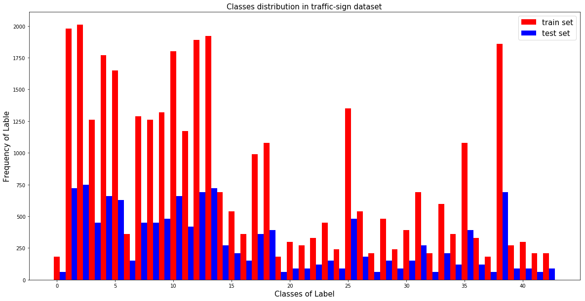
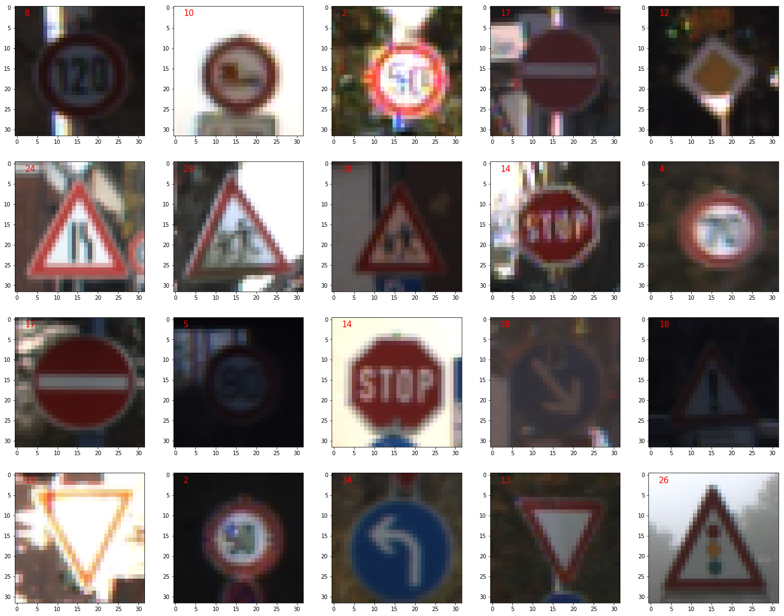
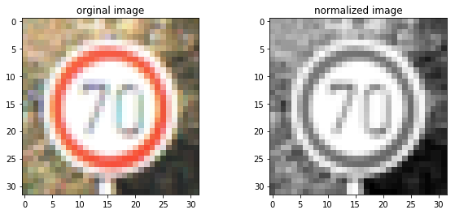
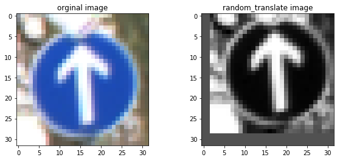
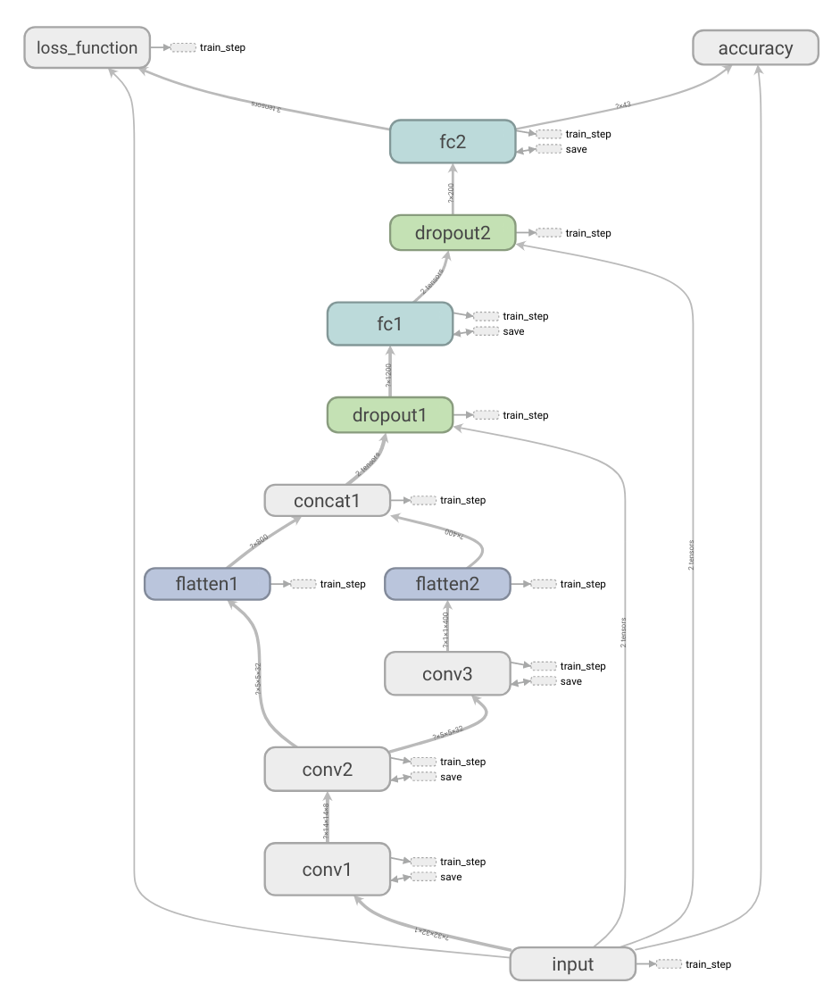
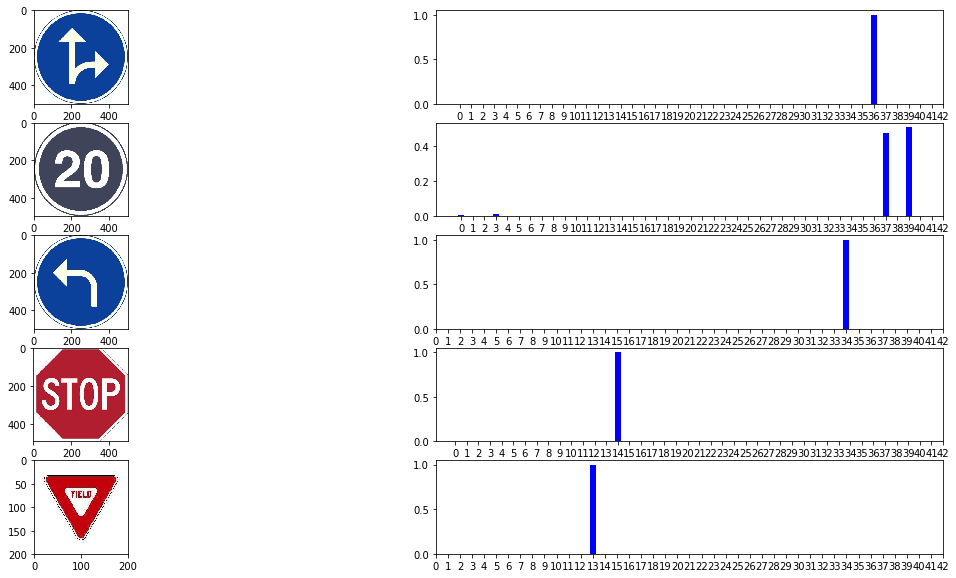

# **Traffic Sign Recognition** 

## Writeup file

---

**Build a Traffic Sign Recognition Project**

The goals / steps of this project are the following:
* Load the data set (see below for links to the project data set)
* Explore, summarize and visualize the data set
* Design, train and test a model architecture
* Use the model to make predictions on new images
* Analyze the softmax probabilities of the new images
* Summarize the results with a written report

### Data Set Summary & Exploration

#### 1. Provide a basic summary of the data set. In the code, the analysis should be done using python, numpy and/or pandas methods rather than hardcoding results manually.

X_train, y_train = train['features'], train['labels']          
X_valid, y_valid = valid['features'], valid['labels']        
X_test, y_test = test['features'], test['labels']

n_train = len(y_train)

n_validation = len(y_valid)

n_test = len(y_test)

image_shape = X_train[0].shape

n_classes = len(set(y_train))

I used python code to calculate summary statistics of the traffic
signs data set:

* The size of training set is 34799
* The size of the validation set is 4410
* The size of test set is 12630
* The shape of a traffic sign image is (32,32,3)
* The number of unique classes/labels in the data set is 43

#### 2. Include an exploratory visualization of the dataset.

Here is an exploratory visualization of the data set. It is a bar chart showing the classes/labels distribution of  the train data and test data

you can see 43 classes with big diffrence in sample number.                
maximum sample number is 2010 in class 2 in train set           
minimum sample number is 180 in class 0 in train set

Random select 20 images, put class/label in left upper corner, plot the image as below:

### Design and Test a Model Architecture

#### 1. Describe how you preprocessed the image data. What techniques were chosen and why did you choose these techniques? Consider including images showing the output of each preprocessing technique. Pre-processing refers to techniques such as converting to grayscale, normalization, etc. (OPTIONAL: As described in the "Stand Out Suggestions" part of the rubric, if you generated additional data for training, describe why you decided to generate additional data, how you generated the data, and provide example images of the additional data. Then describe the characteristics of the augmented training set like number of images in the set, number of images for each class, etc.)

As a first step, I decided to convert the images to grayscale and normalize. weaken color, bright distortion, and the pixes value normalized to (-1,1) will make the model more robust. 

Here is an example of a traffic sign image before and after grayscaling.

for each class has diffrent sample number, someone has big num, while some other has small num. it is difficult to build classifier to learn all class accurately later.

So I apply image augmentation method to generate more samples, to add sample number for small class in train set, finally all classes have same sample number 2010 in train set

Here is an example of an original image and an augmented image:

The difference between the original data set and the augmented data set is the following:

| original training set | augmented training set  |
|:---------------------:|:-----------------------:| 
| The size is 34799     | The size is 86430       |
| shape is (32,32,3)    | shape is (32,32,1)      |

#### 2. Describe what your final model architecture looks like including model type, layers, layer sizes, connectivity, etc.) Consider including a diagram and/or table describing the final model.

My final model consisted of the following layers:

| Layer         		|     Description	        					| 
|:---------------------:|:---------------------------------------------:| 
| Input         		| 32x32x1 GRAY image   							| 
| Conv1 5x5          	| 1x1 stride, VALID padding, outputs 28x28x8 	|
| RELU					| 												|
| Max pooling	      	| 2x2 stride, outputs 14x14x8   				|
| Conv2 5x5	            | 1X1 stride, VALID padding, outputs 10x10x32	|
| RELU					|												|
| Max pooling	      	| 2x2 stride, outputs 5x5x32    				|
| Conv3 5x5     		| X1 stride, VALID padding, outputs 1x1x400 	|
| RELU					|												|
| Flatten				| conv2_flat outputs 800 conv3_flat outputs 400	|
| concatenate			| concatenate 2 flatten layer, output 1x1x1200	|
| Dropout				| 												|
| Fully connected 1		| inputs 1200, outputs 200						|
| Dropout				| 												|
| Fully connected 2		| inputs 200, outputs 43						|

#### 3. Describe how you trained your model. The discussion can include the type of optimizer, the batch size, number of epochs and any hyperparameters such as learning rate.

To train the model, I used fixed learning rate 0.001      
optimizer use AdamOptimizer      
select batch size 128        
EPOCHS choose 10, if over 10, overfit happended. 

the results show below

Training...

EPOCH 1 ...
train_acc = 0.757,val_acc = 0.962

EPOCH 2 ...
train_acc = 0.943,val_acc = 0.971

EPOCH 3 ...
train_acc = 0.966,val_acc = 0.974

EPOCH 4 ...
train_acc = 0.976,val_acc = 0.978

EPOCH 5 ...
train_acc = 0.982,val_acc = 0.977

EPOCH 6 ...
train_acc = 0.985,val_acc = 0.976

EPOCH 7 ...
train_acc = 0.987,val_acc = 0.982

EPOCH 8 ...
train_acc = 0.989,val_acc = 0.981

EPOCH 9 ...
train_acc = 0.990,val_acc = 0.981

EPOCH 10 ...
train_acc = 0.991,val_acc = 0.983

Model saved

#### 4. Describe the approach taken for finding a solution and getting the validation set accuracy to be at least 0.93. Include in the discussion the results on the training, validation and test sets and where in the code these were calculated. Your approach may have been an iterative process, in which case, outline the steps you took to get to the final solution and why you chose those steps. Perhaps your solution involved an already well known implementation or architecture. In this case, discuss why you think the architecture is suitable for the current problem.

I refer to Pierre Sermanet and Yann LeCun's paper and use multi scale convolution architecture.
1. data preprocessing: 
  * convert 3 channel image to gray image
  * aplly CLAHE equalization to gray
  * add 1 dimension to image, chang image shape to 32x32x1, normalization method (img-128.0)/128
2. select adaptive learning rate optimizer Adam with initial learning rate 0.001. 
3. model architecture:
  * 3 convolution layers
  * flatten conv2 and conv3, then concatenate different scale features to one to improve model ability.
  * then add 2 fully connected layers
  * add dropout1 layer between concat1 and fc1 to avoid overfit
  * add dropout2 layer between fc1 and fc2 to aviod overfit

My final model results were:
* training set accuracy of 99.1%
* validation set accuracy of 98.3% 
* test set accuracy of 97.2%

### Test a Model on New Images

#### 1. Choose five German traffic signs found on the web and provide them in the report. For each image, discuss what quality or qualities might be difficult to classify.

Here are ten German traffic signs that I found on the web:

%%html
<figure class="third">
    
    
    
    
    
</figure>

The first 1 images with label '0'(sign is 20) might be difficult to classify. because it's black signs in train set, while it's white signs in download images.  

#### 2. Discuss the model's predictions on these new traffic signs and compare the results to predicting on the test set. At a minimum, discuss what the predictions were, the accuracy on these new predictions, and compare the accuracy to the accuracy on the test set (OPTIONAL: Discuss the results in more detail as described in the "Stand Out Suggestions" part of the rubric).

Here are the results of the prediction:

| Image			          |     Prediction	        					| 
|:-----------------------:|:-------------------------------------------:|
| Go straight or right	  | Go straight or right		     			|
| 20Km					  | Go straight or left							|
| Turn left ahead      	  | Turn left ahead					  			|
| Stop              	  | Stop					        			|
| Yield                   | Yield           			 				|

4 of 5 new image prediction is correct, accuracy is 80%.

in new images dataset, We can see prediction accuracy is less than in test data set. although I have already apply data preprocessing in training data, the traffic sign pattern is different among different regions. for example, in training data set, speed limit sign is black sign. while in download images, speed limit is white sign. it will impact model prediction.

I will consider new ways to generalize model further.

#### 3. Describe how certain the model is when predicting on each of the five new images by looking at the softmax probabilities for each prediction. Provide the top 5 softmax probabilities for each image along with the sign type of each probability. (OPTIONAL: as described in the "Stand Out Suggestions" part of the rubric, visualizations can also be provided such as bar charts)

For the first image, the model is absolutely sure that this is a Go straight or right (probability of 1.0), and the image only contain a Go straight or right sign. The top five soft max probabilities were

| Probability         	|     Prediction	        					| 
|:---------------------:|:---------------------------------------------:| 
| 1.0         			| Go straight or right   						| 
| 0.0     				|      					                 		|
| 0.0					| 					        					|
| 0.0	      			| 					 	            			|
| 0.0				    |        					            		|

all new 5 images top5 probability visualization as the following

please refer to code implementation in file "Traffic_Sign_Classifier-V2"